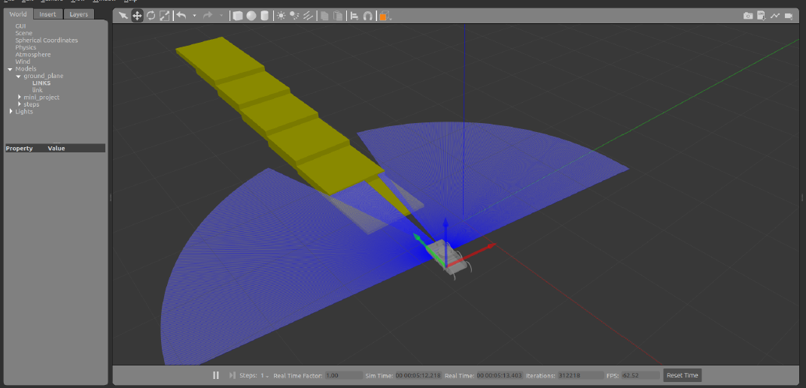

# Hexapod Gait Simulation using ROS 2



A ROS 2-based simulation of a hexapod robot developed to explore robot modeling, gait control, joint coordination, and physics-based simulation using ROS 2, URDF, RViz, and Gazebo.

## Overview

This project implements a complete virtual robotics workflow, from defining the robot structure using URDF to visualizing and controlling its movement in RViz and Gazebo.

The simulation focuses on coordinated leg movement and basic walking gaits while incorporating physical properties such as mass, inertia, gravity, friction, and collisions.

## Features

- 6-legged robotic platform
- URDF/Xacro-based robot description
- Revolute joint modeling
- Joint state visualization in RViz
- Gazebo physics-based simulation
- Python-based ROS 2 control scripts
- Coordinated leg movement
- Basic walking gait implementation
- Collision and ground-contact simulation
- ROS 2 launch files for simulation setup
- Mesh-based visualization and collision models

## Tech Stack

| Technology | Purpose |
|---|---|
| **ROS 2** | Robotics framework and communication |
| **URDF / Xacro** | Robot structure, links, joints, and inertial properties |
| **Gazebo** | Physics-based robot simulation |
| **RViz** | Robot visualization and TF/joint inspection |
| **Python** | Joint control and gait scripts |
| **STL / Meshes** | Robot geometry for simulation |

## System Architecture

```text
3D Robot Model
      ↓
Mesh / STL Files
      ↓
URDF / Xacro
      ↓
ROS 2 Package
      ↓
 ┌───────────────┐
 │               │
RViz           Gazebo
 │               │
 └───────┬───────┘
         ↓
ROS 2 Control Scripts
         ↓
Coordinated Joint Movement
         ↓
Walking Gait
